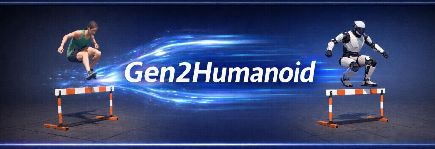
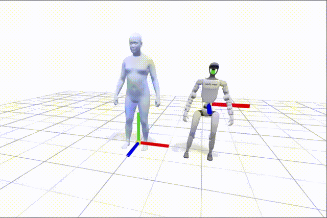
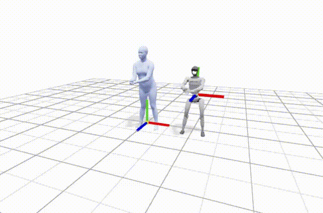
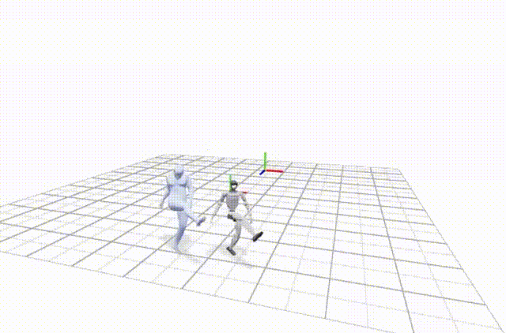
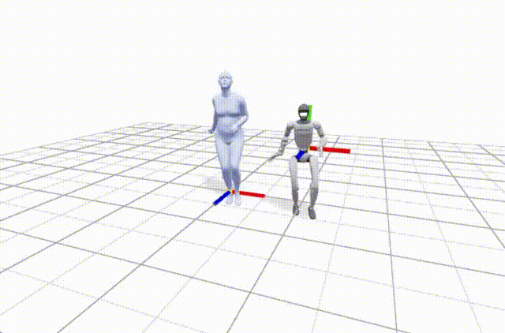

# Gen2Humanoid

Gen2Humanoid is an end-to-end pipeline for Text-to-Motion generation and retargeting human motion to humanoid robots.

<p align="center">
  
</p>

The pipeline supports:

- Text → Human Motion (Hunyuan-Motion-1.0)
- Human Motion → Robot Motion (GMR)
- Visualization side-by-side comparison (viser)

# Demo

| Prompts | Results |
|------|------|
| A person jumps up |  |
| A person plays the piano |  |
| A person runs forward, then kicks a soccer ball |  |
| A person dances jazz, jumping rhythmically |  |

## Pipeline
```css
[Text Prompt]
      ↓
  HY-Motion
      ↓
   SMPL-X
      ↓
     GMR
      ↓
[Humanoid Robot Motion]

```

# Project Structure

```
Gen2Humanoid/
├── g2h/                      # Main package
│   ├── config.py             # Configuration management
│   ├── convert_smpl.py       # Convert smpl to smplx format
│   ├── visualise/            # Visualisation functions 
│   │   └── robot_viser.py    # For robot
│   │   └── smplx_viser.py    # For smplx
│   │   └── motion_player.py  # Play motion
│
├── scripts/                # CLI scripts
│   ├── pipeline.py         # Full pipeline
│   └── visualise.py        # Result visualisation
│
├── data/                     # Prompt data (gitignored)
├── outputs/                  # Temp and final output (gitignored)
│
└── third_party/            # External dependencies (submodules)
    ├── HY-Motion-1.0/      # Motion Generation Model
    └── GMR/                # Motion retargeting to humanoid
```

## Installation


clone repo
```bash
git clone --recursive https://github.com/RavenLeeANU/Gen2Humanoid.git

# Or initialize submodules after cloning
git submodule update --init --recursive

cd Gen2Humanoid
```

create conda environment

```bash
conda create -n g2h python==3.10 -y

conda activate g2h
```

install dependency

```bash

cd third_party/GMR
pip install -e .

cd ../

cd HY-Motion-1.0
pip install -r requirements.txt

cd ../../

pip install -r requirements.txt
```

### 1. HY-Motion-1.0 Environment (Motion Generation)

follow the details to download necessay pretrain models, see [HY-Motion-1.0 README](third_party/HY-Motion-1.0/README.md).


or use download script
```bash
bash command/download_hy_model.sh

```

### 2. GMR Environment (Robot Retargeting)

For details, see [GMR README](third_party/GMR/README.md).

download smplx model, refers to 
```bash
bash commands/download_smplx.sh
```

## Usage

change the params to your own directory and run 

```bash
bash commands/run_pipeline.sh
```
notice: use absolute path if you are not save in the third_party directory. 

for visualize, run 
```bash
bash commands/run_visualise.sh

```

## Supported Robots

| Robot | ID | DOF |
|-------|-----|-----|
| Unitree G1 | `unitree_g1` | 29 |
| Unitree H1 | `unitree_h1` | 19 |
| Booster T1 | `booster_t1` | 23 |

See [GMR README](third_party/GMR/README.md) for full list

## Output Format

```python
# robot_motion.pkl
{
    "fps": 30.0,
    "robot_type": "unitree_g1",
    "num_frames": 240,
    "root_pos": np.ndarray,    # (N, 3)
    "root_rot": np.ndarray,    # (N, 4) quaternion xyzw
    "dof_pos": np.ndarray,     # (N, DOF)
}
```

# TODO
- [ ] **Post Process Module**
  - Fix generated motion artifacts such as foot sliding, self-colliding etc.

- [ ] **Conditional Motion Generation Module**
  - Control the generation motion by providing a pose or a trajectory.

- [ ] **Motion Blending Module**
  - Intepolate motion between two different poses or motion clips

- [ ] **Motion Tracking Module**
  - Track the generated motion by motion trackers

## Acknowledgements

This project builds upon the following excellent open source projects:

- [HY-Motion-1.0](https://github.com/Tencent-Hunyuan): 3D human motion genetation by prompt
- [GMR](https://github.com/YanjieZe/GMR): general motion retargeting framework

Part of visualisation codes are borrowed from the project:

- [video2robot](https://github.com/AIM-Intelligence/video2robot) : A video reconstruct motion retargeting pipeline


## License

This project depends on third-party libraries with their own licenses:

- **[GMR](third_party/GMR/LICENSE)**: MIT License
- **[HY-Motion-1.0](third_party/HY-Motion-1.0/License.txt)**: Non-Commercial Scientific Research Use Only

Please review both licenses before use.

> The core gen2humanoid code is MIT-licensed, but using this
> repository end-to-end (including PromptHMR) inherits HY-Motion-1.0's
> **Non-Commercial Scientific Research Only** restriction. Commercial use
> requires obtaining appropriate permission from the HY-Motion-1.0 authors.
